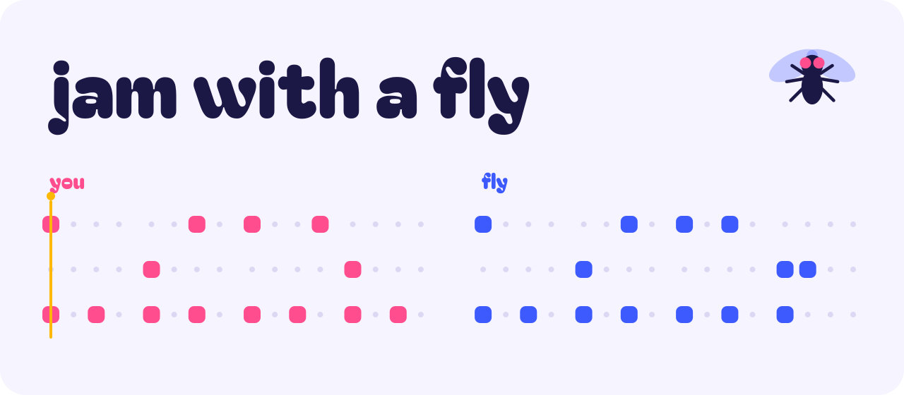
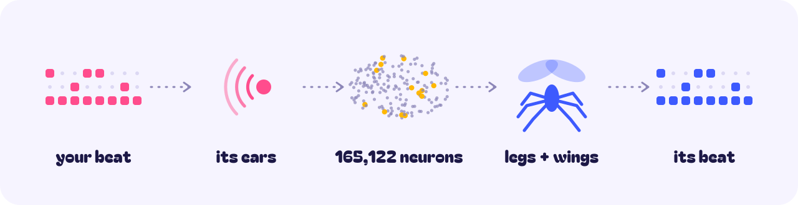

<picture>
  <source media="(prefers-color-scheme: dark)" srcset="assets/hero-dark.svg">
  
</picture>

<br>
<br>

<p align="center">
  You play a beat.<br>
  A simulated fruit fly hears it, then plays it back.
</p>

<p align="center">
  
  
  
</p>

<br>
<br>

<picture>
  <source media="(prefers-color-scheme: dark)" srcset="assets/demo-dark.svg">
  
</picture>

<br>
<br>
<br>

### How it works

<br>

<picture>
  <source media="(prefers-color-scheme: dark)" srcset="assets/how-dark.svg">
  
</picture>

<br>

Built on the real wiring diagram of a male fruit fly, mapped neuron by neuron by Janelia, Cambridge and Google Research.

<br>
<br>

### Try it

```bash
git clone https://github.com/YOUR_USERNAME/jam-with-a-fly
cd jam-with-a-fly
pip install -r requirements.txt
python build_graph.py
```

<sub>The connectome download (1.1 GB, no login) is in <a href="PLAN.md">PLAN.md</a>.</sub>

<br>
<br>

### Real vs. chosen

| Real | Chosen by us |
|:--|:--|
| Every neuron and synapse | Asking a fly to drum |
| How the neurons fire | Which neurons count as drums |
| How flies learn | The goal: copy my beat |

<br>
<br>

### Credits

<sub>
Data: <a href="https://male-cns.janelia.org/">MaleCNS v1.0</a> by HHMI Janelia FlyEM, Cambridge Connectomics Group and Google Research, CC-BY 4.0<br>
Forked from <a href="https://github.com/sykeriin/fly-drums">sykeriin/fly-drums</a>, with code from <a href="https://github.com/fruitflydev/flycoinrh">fruitflydev/flycoinrh</a><br>
Simulation approach after Shiu et al. 2024 (Nature). Learning rule after Hige et al. 2015 and Cohn et al. 2015.
</sub>

<br>
<br>
<br>

<picture>
  <source media="(prefers-color-scheme: dark)" srcset="assets/footer-dark.svg">
  
</picture>
